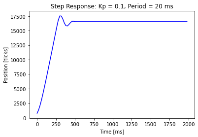
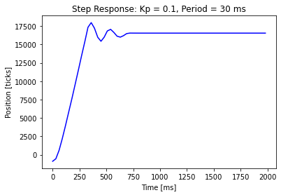
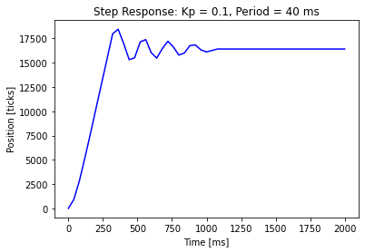

# ME 405 Lab 3 Repository

### Documentation
##### In this lab we implemented a scheduler running two tasks pseudo-simultaneously where each task ran a motor, encoder, and controller. 
##### The step response for both motor tasks was performed and data from one encoder was plotted, showing the results for one rotation of the flywheel. 
##### Tests were run with task frequencies of varying speeds to determine the slowest rate at which the controller performance was still functional without significant degradation. 
##### Our team determined that a period of 20 ms is ideal for controller performance, but will still perform adequately at 30 ms. 
##### At a period of 40 ms, the controller performance is significantly worse and not recommended. 
##### 
##### The step response plots are shown below.

#### Step Response Plots

#### docs
###### Contains html files for Lab 3 documentation. 

#### src
###### Contains source code files for Lab 3. 
